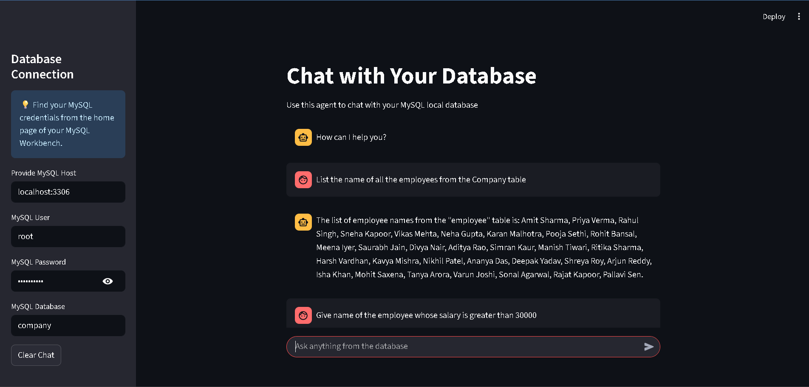

# 🗃️ Chat with Your Local MySQL Database
## 🚀 Demo Video: [Click Here](https://drive.google.com/file/d/1kz2gqfoaEissVd420Gf8Gbjh9d-jsQUl/view?usp=sharing)



Transform your local MySQL database interactions with AI! This Streamlit application runs entirely on your local machine, letting you query your local database using plain English - no SQL knowledge required. Just connect to your local MySQL server and start asking questions like "Who are my top customers?" or "What's the average sales this month?"


## 🚀 Features

- **Local Database Access**: Connect to your local MySQL server running on your machine
- **Natural Language Queries**: Ask questions about your data in plain English
- **Real-time Streaming**: Get responses as they're generated
- **Memory Support**: Maintains conversation context for follow-up questions
- **Secure Local Connection**: All data stays on your local machine
- **Error Handling**: Comprehensive error messages for troubleshooting
- **Easy-to-use Interface**: Clean and intuitive Streamlit UI running locally

## 🛠️ Technologies Used

<div align="center">

| Technology | Purpose | Logo |
|------------|---------|------|
| **Streamlit** | Web Application Framework |  |
| **LangChain** | AI Agent Framework |  |
| **MySQL** | Database Management |  |
| **Groq** | AI Language Model |  |
| **SQLAlchemy** | Database ORM |  |

</div>

## 📋 Prerequisites

Before you begin, ensure you have:

1. **Python 3.8+** installed on your local machine
2. **MySQL Server** running locally on your computer
3. **Groq API Key** (free tier available at [Groq Console](https://console.groq.com/))
4. A **local MySQL database** with some data to query

## 🔧 Installation

1. **Clone the repository**
   ```bash
   git clone https://github.com/yourusername/database-chat-app.git
   cd database-chat-app
   ```

2. **Install required packages**
   ```bash
   pip install streamlit langchain langchain-groq sqlalchemy mysql-connector-python
   ```

3. **Set up Groq API Key**
   
   Create a `.streamlit/secrets.toml` file in your project directory:
   ```toml
   GROQ_API_KEY = "your_groq_api_key_here"
   ```

## 🚀 Usage

### Step 1: Start the Local Application
```bash
streamlit run app.py
```

The application will start locally and open in your default browser at `http://localhost:8501`

### Step 2: Configure Local Database Connection

When the application opens, you'll see the sidebar with database connection fields:


Fill in your local MySQL connection details:

- **MySQL Host**: Your local database server address
  - For local MySQL: `localhost` or `127.0.0.1:3306`
  - Standard local port: `3306` (unless you changed it during MySQL installation)
- **MySQL User**: Your local database username (typically `root`)
- **MySQL Password**: Your local MySQL password (set during installation)
- **MySQL Database**: Name of your local database

#### Example Local Configuration:
```
MySQL Host: localhost:3306
MySQL User: root  
MySQL Password: ••••••••
MySQL Database: my_local_db
```

### Step 3: Start Chatting!

Once connected, you can start asking questions about your database:

#### Example Queries:
- "How many employees do we have?"
- "Show me the top 5 highest paid employees"
- "What's the average salary by department?"
- "List all customers from California"
- "Find products with stock less than 10"

#### Follow-up Questions:
The app remembers context, so you can ask follow-up questions:
- First: "Who is the oldest employee?"
- Then: "What's their salary?" *(remembers the oldest employee)*

### Step 4: View Results

The AI will:
1. Understand your question
2. Generate appropriate SQL queries
3. Execute them on your database
4. Present results in a readable format

## 📸 Screenshots

### Local Application Interface
*The main interface running on localhost:8501 showing database connection fields*


### Sample Conversation
*Example of natural language database interaction*


## 🔒 Local Security Notes

- Database passwords are masked in the UI and never stored
- All data processing happens locally on your machine
- No data is sent to external servers (except AI API calls for query generation)
- Connection details are only held in memory during the session
- Your local MySQL server should have proper user permissions configured

## ⚠️ Common Issues & Solutions

### Local Connection Issues
- **Error**: "Database connection failed"
  - **Solution**: Verify MySQL server is running locally (`mysql -u root -p` in terminal)
  - Check if MySQL service is started on your machine
  - Ensure MySQL is listening on port 3306 (default port)

### Local MySQL Setup Issues
- **Error**: "Can't connect to MySQL server on 'localhost'"
  - **Solution**: Start MySQL service on your local machine
  - Windows: Check Services or use MySQL Workbench
  - macOS: `brew services start mysql` or System Preferences
  - Linux: `sudo systemctl start mysql`

### Permission Issues
- **Error**: "Access denied for user 'root'@'localhost'"
  - **Solution**: Verify your local MySQL root password
  - Reset MySQL root password if forgotten
  - Ensure the user has SELECT privileges on your local database

### Package Issues
- **Error**: "Module not found"
  - **Solution**: Install missing packages using pip install


## 📄 License

This project is licensed under the MIT License - see the [LICENSE](LICENSE) file for details.

## 🆘 Support

If you encounter any issues:

1. Check the [Common Issues](#-common-issues--solutions) section
2. Open an issue on GitHub
3. Provide your error logs and configuration (without sensitive data)


<div align="center">

**Made with ❤️ using Streamlit and LangChain**

[⭐ Star this repo](https://github.com/yourusername/database-chat-app) if you found it helpful!

</div>
